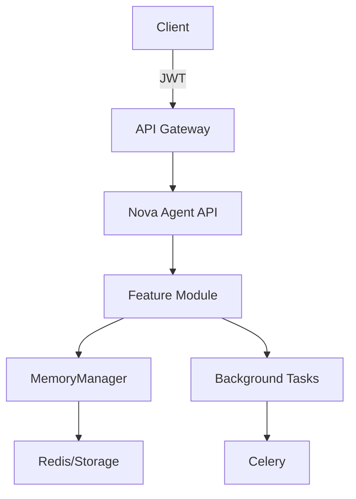

# Architecture Design: [Feature Name]

## System Overview

## Component Design

### API Layer
- Endpoint: `/api/v1/[feature]`
- Authentication: JWT middleware
- Authorization: RBAC checks
- Validation: Pydantic models

### Business Logic
- Module: `nova/[feature].py`
- Async operations
- Error handling with custom exceptions
- Logging and metrics

### Data Layer
- Integration with MemoryManager
- Caching strategy
- Data persistence approach

### Background Processing
- Celery tasks for async operations
- Task scheduling
- Result storage

## Integration Points
1. **MemoryManager**: Store feature data
2. **Auth System**: JWT/RBAC integration
3. **Task Manager**: Background processing
4. **Monitoring**: Prometheus metrics

## Security Considerations
- Input validation
- Rate limiting
- Audit logging
- Data encryption

## Scalability Design
- Horizontal scaling support
- Caching layers
- Database optimization
- Load balancing ready
